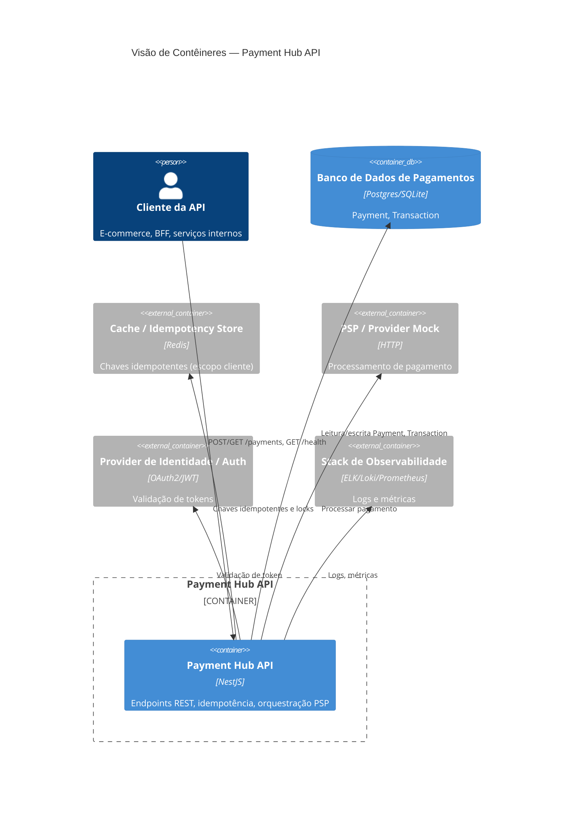
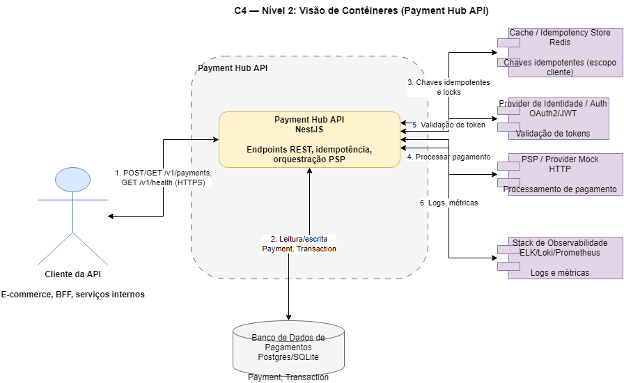

## C4 — Nível 2: Visão de Contêineres (Payment Hub API)

### 1. Contêineres principais

- **C1. Cliente da API (External Application)**
  - Qualquer sistema que consome o hub (e-commerce, ERP, BFF, serviço interno).
  - Fala HTTP/HTTPS com o hub.
  - Responsável por:
    - Enviar `Authorization`, `Idempotency-Key` e `X-Correlation-Id`.
    - Tratar respostas e erros padronizados.

- **C2. Payment Hub API (NestJS Application) — Contêiner principal**
  - Aplicação NestJS em execução (nó de aplicação).
  - Contém os módulos de negócio e infraestrutura:
    - `PaymentsModule`, `TransactionsModule`, `IdempotencyModule`,
      `ProvidersModule`, `AuthModule`, `Shared/Observability`, etc.
  - Responsabilidades:
    - Expor endpoints REST públicos.
    - Autenticar/autorizar requisições.
    - Validar payloads.
    - Orquestrar regras de negócio de pagamento.
    - Implementar idempotência.
    - Integrar com DB, cache e PSP.
    - Emitir logs, métricas e traces.

- **C3. Banco de Dados de Pagamentos (Relational Database)**
  - Banco relacional (Postgres, SQLite, etc.).
  - Responsável por persistir:
    - Entidades `Payment` (incluindo `status`, `amount`, `customerId`, `merchantId` — expostos na API como `payer`/`payee` —, `idempotencyKey`, `externalReference`, escopo do cliente, timestamps).
    - Entidades `Transaction` (status, PSP, referências, timestamps).
  - Fornece:
    - Consistência forte das escritas.
    - Consultas eficientes por `paymentId`, `externalReference`, escopo do cliente, etc.

- **C4. Cache / Idempotency Store (Redis ou similar)**
  - Armazenamento chave-valor de baixa latência.
  - Responsável por:
    - Manter índice de idempotência: **escopo do cliente autenticado** + `Idempotency-Key` → `paymentId` / hash de payload. *O MVP não assume multi-tenant explícito; em evolução futura o escopo poderá ser materializado como `tenantId`.*
    - Apoiar detecção de replays e conflitos.
    - Possível base para rate limiting.

- **C5. Provedor de Pagamento / PSP Mock (External Service)**
  - Serviço externo (pode ser mockado em dev) para simular/realizar operações de pagamento.
  - Responsável por:
    - Receber solicitações de transação do hub.
    - Responder com status de autorização/liquidação/falha.

- **C6. Provider de Identidade / Auth (External Service)**
  - Serviço de autenticação/autorização (OAuth2/JWT).
  - Responsável por:
    - Emitir tokens usados pelo Cliente da API.
    - Permitir validação de `Authorization` pelo hub.

- **C7. Stack de Observabilidade / Logging (External Service)**
  - Centralização de logs e métricas (por exemplo: ELK, Loki, Prometheus, etc., ou equivalente simples).
  - Responsável por:
    - Receber logs estruturados e métricas.
    - Permitir consultas por `correlationId`, `paymentId`, `errorCode`, etc.

### 2. Relações entre contêineres

- **C1 → C2: Cliente da API → Payment Hub API**
  - HTTP/HTTPS:
    - `POST /v1/payments`
    - `GET /v1/payments/{paymentId}` (ou variante por `externalReference`)
    - `GET /v1/payments/by-idempotency-key/{idempotencyKey}`
    - `GET /v1/health` ou `GET /health` (healthcheck)
  - Headers:
    - `Authorization` (obrigatório).
    - `Idempotency-Key` (obrigatório na criação).
    - `X-Correlation-Id` (opcional; gerado pelo hub se ausente).

- **C2 ↔ C3: Payment Hub API ↔ Banco de Dados de Pagamentos**
  - Escritas:
    - Criação de registros `Payment` e `Transaction`.
    - Atualização de estados de pagamento/transação.
    - Persistência de vínculos de idempotência (se persistidos em DB).
  - Leituras:
    - Consulta de pagamentos para leitura (fluxo de consulta).
    - Uso de filtros por escopo do cliente, externalReference, etc.

- **C2 ↔ C4: Payment Hub API ↔ Cache / Idempotency Store**
  - Escritas:
    - Registro imediato de (escopo do cliente autenticado, `Idempotency-Key`) → `paymentId` / hash de payload.
    - Criação de locks simples (chaves com TTL) para evitar corrida.
  - Leituras:
    - Verificação rápida de existência da chave idempotente.
    - Recuperação de dados para comparar payloads.

- **C2 ↔ C5: Payment Hub API ↔ Provedor de Pagamento / PSP Mock**
  - Escritas:
    - Envio de requisições para processar transações de pagamento.
  - Leituras:
    - Recebimento do resultado da tentativa (status, códigos de erro).

- **C2 ↔ C6: Payment Hub API ↔ Provider de Identidade / Auth**
  - Leituras (em geral):
    - Validação de token `Authorization`.
    - Opcionalmente introspecção de token ou busca de chaves públicas.

- **C2 → C7: Payment Hub API → Stack de Observabilidade / Logging**
  - Envio de:
    - Logs estruturados (incluindo `correlationId`, `paymentId`, escopo do cliente).
    - Métricas de contadores/latências/erros.

### 3. Boundaries e responsabilidades por contêiner

- **Payment Hub API (C2)**
  - **Boundary de aplicação**:
    - Isola regras de pagamento de detalhes específicos de DB, cache e PSP.
    - Expõe apenas um contrato HTTP bem definido.
  - **Responsabilidades**:
    - Autenticar/autorizar por token.
    - Validar payloads e aplicar regras de negócio.
    - Implementar idempotência (com apoio de DB e/ou Redis).
    - Orquestrar chamadas ao PSP.
    - Gerar respostas determinísticas para fluxos idempotentes.
    - Produzir logs e métricas.

- **Banco de Dados (C3)**
  - **Boundary de persistência primária**:
    - Fonte de verdade para o estado de `Payment` e `Transaction`.
  - **Responsabilidades**:
    - Garantir integridade e consistência.
    - Permitir consultas eficientes pelos identificadores relevantes.

- **Cache / Idempotency Store (C4)**
  - **Boundary de armazenamento efêmero/rápido**:
    - Auxiliar, mas não substituir, o DB como fonte de verdade.
  - **Responsabilidades**:
    - Rápida verificação de replays idempotentes.
    - Redução de carga sobre o DB em cenários de alta taxa de requisições.
    - Possível rate limiting por cliente.

- **PSP / Provider Mock (C5)**
  - **Boundary externo financeiro**:
    - Responsável pela lógica de processamento financeiro.
  - **Responsabilidades**:
    - Receber requisições do hub e devolver status da tentativa.

- **Provider de Identidade (C6)**
  - **Boundary de segurança**:
    - Responsável pela emissão/validação de credenciais.
  - **Responsabilidades**:
    - Permitir ao hub validar `Authorization`.

- **Stack de Observabilidade (C7)**
  - **Boundary de monitoramento**:
    - Não participa do fluxo funcional diretamente, mas observa tudo.
  - **Responsabilidades**:
    - Permitir rastreio e diagnóstico via logs/métricas/traces.

### 4. Diagrama textual de contêineres (estilo C4)

- **Contêineres**
  - `C1: Cliente da API` (External Application).
  - `C2: Payment Hub API` (NestJS Application).
  - `C3: Banco de Dados de Pagamentos` (Relational Database).
  - `C4: Cache / Idempotency Store` (Redis ou similar).
  - `C5: Provedor de Pagamento / PSP Mock` (External Service).
  - `C6: Provider de Identidade / Auth` (External Service).
  - `C7: Stack de Observabilidade / Logging` (External Service).

- **Relações**
  - `C1 -> C2`: HTTP/HTTPS (rotas `/v1/...`) com `Authorization`, `Idempotency-Key`, `X-Correlation-Id`.
  - `C2 -> C3`: leitura/escrita de `Payment` e `Transaction`.
  - `C2 -> C4`: leitura/escrita de chaves de idempotência e locks.
  - `C2 -> C5`: chamadas de processamento de pagamento.
  - `C2 -> C6`: validação de tokens.
  - `C2 -> C7`: envio de logs e métricas.

### 5. Diagrama C4 — Contêineres (Mermaid)

O diagrama abaixo pode ser renderizado em ferramentas que suportam Mermaid. O código-fonte também está em `docs/c4/diagrams/container.mmd` para geração de imagens.

**Imagem gerada (PNG):**

