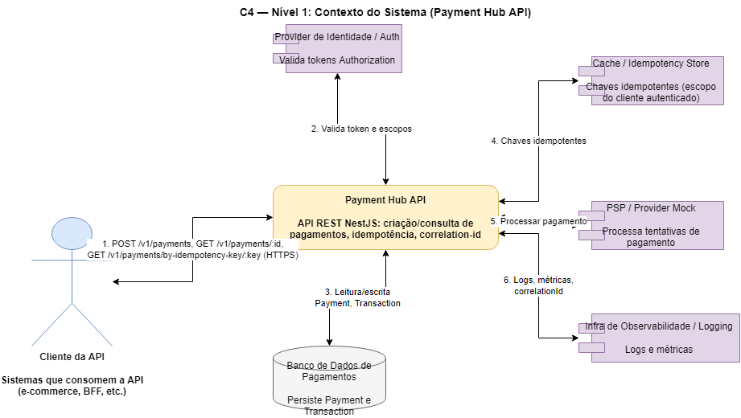

## C4 — Nível 1: Contexto do Sistema (Payment Hub API)

### 1. Sistema em foco

**Sistema em foco**: `Payment Hub API` — API REST em NestJS que centraliza e padroniza a orquestração de pagamentos, com foco em:

- Criação de pagamento.
- Consulta de pagamento.
- Idempotência baseada em `Idempotency-Key`.
- Rastreabilidade via `X-Correlation-Id`.
- Padrão de erro unificado.

### 2. Pessoas (Actors)

- **Cliente da API (Person)**  
  - Sistemas externos (e-commerces, backends BFF, serviços internos) que consomem a `Payment Hub API`.
  - Responsabilidades:
    - Enviar requisições HTTP autenticadas com `Authorization`.
    - Gerar e reutilizar `Idempotency-Key` para criação de pagamentos.
    - Propagar (ou consumir) `X-Correlation-Id` para rastreabilidade ponta a ponta.
    - Interpretar respostas de sucesso/erro e seguir o fluxo de negócio.

### 3. Sistemas / Contexto

- **Payment Hub API (Software System) — sistema em foco**
  - Aplicação NestJS que expõe endpoints REST.
  - Expõe, entre outros: `POST /v1/payments`, `GET /v1/payments/{paymentId}`, `GET /v1/payments/by-idempotency-key/{idempotencyKey}`, e endpoint de saúde `GET /v1/health` ou `GET /health` (conforme OpenAPI).
  - Responsabilidades:
    - Receber, validar e autenticar requisições de criação/consulta de pagamento.
    - Aplicar regras de negócio mínimas e idempotência.
    - Orquestrar chamadas a provedores de pagamento (PSPs).
    - Persistir entidades `Payment` e `Transaction`.
    - Expor respostas com modelo consistente e padrão de erro `{ code, message, details?, correlationId }`.
    - Produzir logs estruturados com `correlationId`.

- **PSP / Provider Mock (External Software System)**
  - Sistema externo (real ou simulado) que processa tentativas de pagamento.
  - Responsabilidades:
    - Receber requisições do hub para autorizar/processar pagamentos.
    - Responder com estados como `AUTHORIZED`, `DECLINED`, `PENDING`, `FAILED`, etc.

- **Banco de Dados de Pagamentos (Database System)**
  - Banco relacional (Postgres, SQLite ou equivalente) usado como armazenamento primário.
  - Responsabilidades:
    - Persistir:
      - Entidades `Payment`.
      - Entidades `Transaction`.
      - Relações e dados necessários à idempotência.
    - Garantir integridade referencial e consistência forte das escritas.

- **Cache/Idempotency Store (Redis ou Similar) (Optional External System)**
  - Armazenamento chave-valor de baixa latência para suporte à idempotência e rate limiting.
  - Responsabilidades:
    - Manter mapeamentos rápidos de (**escopo do cliente autenticado** + `Idempotency-Key`) → `paymentId` / hash de payload. *O MVP não assume multi-tenant explícito; o escopo de idempotência é o cliente autenticado. Em evolução futura esse escopo poderá ser materializado como `tenantId`.*
    - Ajudar a prevenir race conditions em cenários de alta concorrência.

- **Infra de Observabilidade / Logging (External System)**
  - Stack de logs/métricas/tracing (pode ser apenas stdout + agregador no MVP).
  - Responsabilidades:
    - Receber logs estruturados de requisições e integrações.
    - Permitir inspecionar fluxos por `correlationId`, `paymentId`, `errorCode`, etc.

- **Provider de Identidade / Auth (External System, conceitual)**
  - Serviço de autenticação/autorização (ex.: OAuth2/JWT provider).
  - Responsabilidades:
    - Emissão e validação de tokens usados no header `Authorization`.

### 4. Relações de alto nível (Contexto)

- **Cliente da API → Payment Hub API**
  - `HTTP POST /v1/payments` (criação de pagamento) com:
    - `Authorization` (obrigatório).
    - `Idempotency-Key` (obrigatório na criação).
    - `X-Correlation-Id` (opcional; gerado pelo hub se ausente).
    - Body com `payer`, `payee` (vocabulário da API; internamente normalizados para `customerId`/`merchantId`), `amount`, `currency`, `paymentMethod`, `externalReference`, etc.
  - `HTTP GET /v1/payments/{paymentId}` (consulta de pagamento) com:
    - `Authorization`.
    - `X-Correlation-Id` (opcional).
  - `HTTP GET /v1/payments/by-idempotency-key/{idempotencyKey}` (consulta por chave de idempotência) com:
    - `Authorization`.
    - `X-Correlation-Id` (opcional).
  - Recebe como resposta:
    - Representação do `Payment` (status, valores, metadados) ou erro padronizado.

- **Payment Hub API ↔ Provider de Identidade / Auth**
  - Valida tokens presentes em `Authorization`.
  - Usa claims/escopos para autorização (escopo do cliente autenticado; evolução: multi-tenant).

- **Payment Hub API ↔ Banco de Dados de Pagamentos**
  - Escritas:
    - Criação e atualização de `Payment`.
    - Criação e atualização de `Transaction`.
    - Armazenamento de metadados de idempotência (quando persistidos em DB).
  - Leituras:
    - Busca de `Payment` por `paymentId`, `externalReference` e/ou `Idempotency-Key`.
    - Recuperação de `Transaction` associada para compor respostas.

- **Payment Hub API ↔ Cache/Idempotency Store**
  - Escritas:
    - Registro rápido de (escopo do cliente autenticado, `Idempotency-Key`) → `paymentId` / hash de payload.
  - Leituras:
    - Verificação rápida se a chave idempotente já foi usada.
    - Comparação de payload para detecção de conflito (`PAYMENT_IDEMPOTENCY_CONFLICT`).

- **Payment Hub API ↔ PSP / Provider Mock**
  - Chamada para criar/autorizar pagamento junto ao PSP.
  - Recebimento de resposta com status da tentativa.
  - Propagação de `correlationId` quando possível.

- **Payment Hub API → Infra de Observabilidade / Logging**
  - Emissão de logs estruturados e métricas mínimas:
    - `correlationId`, `paymentId`, escopo do cliente, `status`, `errorCode`, latência, etc.

### 5. Boundaries de contexto

- **Boundary externo (Cliente da API)**
  - Fora do domínio da `Payment Hub API`.
  - Define como e quando gerar `Idempotency-Key` e `X-Correlation-Id`.
  - Interage apenas via contrato HTTP documentado.

- **Boundary da Payment Hub API**
  - Local onde:
    - Regras de negócio de pagamento são aplicadas.
    - Idempotência é implementada.
    - Integrações com DB, Cache e PSP são coordenadas.
  - Protegido por autenticação/autorização.

- **Boundary de infraestrutura (DB + Cache + Observabilidade)**
  - Serviços de apoio, acessados somente pela `Payment Hub API`.
  - Não expostos diretamente para o Cliente da API.

- **Boundary de provedores (Auth e PSP)**
  - Sistemas terceiros, com contratos específicos.
  - Encapsulados por abstrações internas no hub.

### 6. Diagrama textual de contexto (estilo C4)

- **Pessoas**
  - `Cliente da API` (Person) — consome a `Payment Hub API`.

- **Sistema em foco**
  - `Payment Hub API` (Software System) — expõe API REST de pagamentos com idempotência, rastreabilidade e padronização de erros.

- **Sistemas externos**
  - `Provider de Identidade / Auth` — valida tokens de `Authorization`.
  - `PSP / Provider Mock` — processa tentativas de pagamento.
  - `Banco de Dados de Pagamentos` — armazena `Payment` e `Transaction`.
  - `Cache/Idempotency Store` (Redis ou similar) — acelera e reforça a idempotência.
  - `Infra de Observabilidade / Logging` — centraliza logs e métricas.

- **Relações**
  - `Cliente da API -> Payment Hub API`: requisições HTTP autenticadas para criação/consulta de pagamentos.
  - `Payment Hub API -> Provider de Identidade / Auth`: validação de tokens e escopos.
  - `Payment Hub API -> Banco de Dados de Pagamentos`: leitura/escrita de `Payment` e `Transaction`.
  - `Payment Hub API -> Cache/Idempotency Store`: leitura/escrita de chaves idempotentes.
  - `Payment Hub API -> PSP / Provider`: orquestração de tentativas de pagamento.
  - `Payment Hub API -> Infra de Observabilidade / Logging`: envio de logs/métricas com `correlationId`.

### 7. Diagrama C4 — Contexto (draw.io)

O diagrama está em formato draw.io (XML) em `docs/c4/diagrams/context.drawio`, com **sequências numeradas** em cada ligação. Pode ser editado em [app.diagrams.net](https://app.diagrams.net) ou no Draw.io desktop. A imagem PNG é gerada a partir do `.drawio` (ver README na pasta `diagrams/`).

